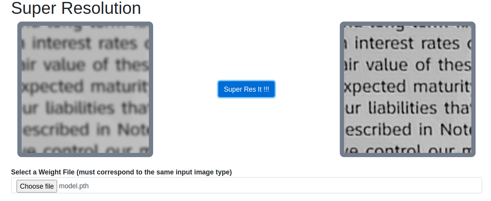

# Super Resolution

## Video Demo

There are some demonstration videos for this project on YouTube, see [playlist](https://www.youtube.com/playlist?list=PLUxw2JoWliip9Cin-sho2xMPRpKqa89Tz).

- [Introduction Video](https://youtu.be/IncGhJ3bBMQ)
- [How to Test Demo](https://youtu.be/oldS47apL7s)
- [Web App Demo](https://youtu.be/lhL6jEjBWXw)

## Prerequisites

Use [requirements.txt](./requirements.txt) to install all dependencies. (for anaconda)

`pip install -r requirements.txt`

The pytorch version we are using is **1.7.0** with cuda **11.0**. If you are not using the same cuda driver, please make sure you install the correct version for your OS.

## Dataset
We used 2 Datasets generated by ourselves by augmenting some other existing datasets.

For more details, see the following pages,

[Datasets](./datasets)
- [DIV2K](./datasets/DIV2K) E.  Agustsson  and  R.  Timofte,  "Ntire  2017  challenge  on  single  imagesuper-resolution: Dataset and study," in *The IEEE Conference on Com-puter Vision and Pattern Recognition (CVPR) Workshops*, July 2017
- [TEXT](./datasets/TEXT) I. Zharikov, F. Nikitin, I. Vasiliev, and V. Dokholyan, "DDI-100: datasetfor  text  detection  and  recognition,"CoRR,  vol.  abs/1912.11658,  2019.[Online]. Available: http://arxiv.org/abs/1912.11658

## Contents

- [Trainer Framework](./SR): A trainer framework to make training a tracking easier
- [Models](./SR/model): All models are here
- [Experiments Results](https://onedrive.live.com/?authkey=%21AFA6I61NVeysBP8&id=7A78FD2CB5D891D5%21161697&cid=7A78FD2CB5D891D5): All experiments results with model weights (more than 30GB in total)

## How to Train

Since we have many models and different parameters for training, instead of using a command line tool, we believe it's clearer to just use a python script for training.

All training can be done within [SR](./SR). Use the template training file [train_template.py](./SR/train_template.py) for training. More instructions on how it works can be found here [SR Instructions](./SR/README.md).

## How to Test

We prepared some scripts for testing. Testing requires you to download weight files from our experiment results. See [Contents](#contents)

See [how-to-test.md](./how-to-test.md) for more instructions.

## Visualizer

We made a Visualizer Web App for single image Super Resolution.

See [web](./web/README.md) for more instructions.

